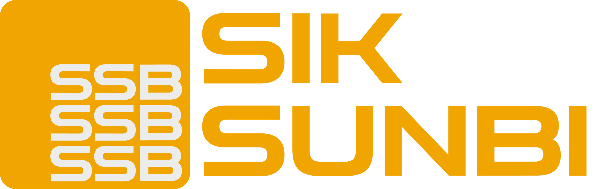

 
<!-- 목차 -->

**목차**

<ul>
    <li><a href="#개요">개요</a></li>
    <li><a href="#페이지-구성">페이지 구성</a></li>
    <li><a href="#기능">기능</a></li>
    <li><a href="#배포주소">배포주소</a></li>
    <li><a href="#browser-support">Browser Support</a></li>
    <li><a href="#stacks">Stacks</a></li>
    <li><a href="#members">Members</a></li>
</ul>

---

# 개요

- 프로젝트명 : SIKSUNBI
- 기간 : 2023.02.26. ~ 2023.00.00.
- 목표 : -

# 페이지 구성

## Mobile

# 기능

- CSS reset for cross browsing(styled-reset)
- React Bootstrap
- Router(React Router-dom)
- 현재 페이지 표시(React Router-dom)

- @media (prefers-color-scheme: dark) 를 이용한 다크모드 적용 하기

<!-- - Mobile sticky header(CSS)
- Mobile navigation box(React)
- Location map(Kakao map api)
- Copy alert(React Bootstrap)
- Carousel slider(React Bootstrap) -->

## 앞으로 구현하고자 하는 것은

-

# 배포주소

-

# Browser Support

- 
- 
- 

# Stacks

## Environment

- 
- 
- 

## Developement

- 

# Members

## 홍

- https://github.com/coldair426
- https://velog.io/@coldair426
- coldair426@gmail.com

---

**Full README가 보고 싶다면 [velog]()를 참고하세요.**
