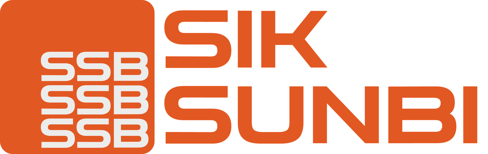
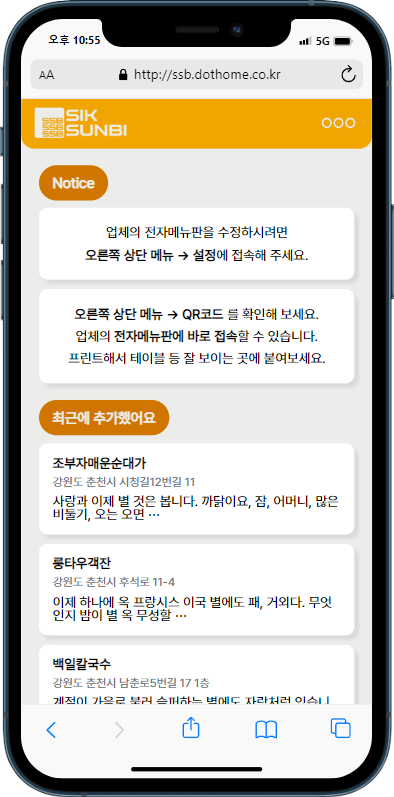
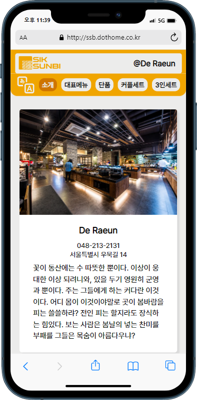

 

 
<!-- Index -->

**Index**

<ul>
    <li><a href="#overview">Overview</a></li>
    <li><a href="#introduction">Introduction</a></li>
    <li><a href="#configuration">Configuration</a></li>
    <li><a href="#roadmap">Roadmap</a></li>
    <li><a href="#stacks">Stacks</a></li>
   <li><a href="#browser-support">Browser Support</a></li>
   <li><a href="#members">Members</a></li>
</ul>

---

# Overview

- **프로젝트명**: SIKSUNBI

- **기간**: 2023.02.26. ~ 2023.03.07.

- **목표**: 음식점의 모바일 메뉴판과 QR코드를 생성해주는 서비스 입니다.

- **배포주소**: http://ssb.dothome.co.kr/

# Introduction

**SIKSUNBI**는 음식점의 모바일 메뉴판과 QR코드를 생성해주는 웹 서비스 입니다.

**주요 기능**:

- **메뉴판**: 간편하게 음식점의 모바일 메뉴판을 생성할 수 있고, 누구나 편하게 접속 할 수 있습니다.

- **QR코드**: 음식점의 모바일 메뉴판 URL을 QR코드로 제공하고, 이를 통해 손님이 테이블에서 간편하게 접속할 수 있습니다.

- **모바일 최적화 및 사용자 경험**: 모바일 환경에 최적화된 디자인을 가지고 있습니다. 다양한 모바일 디바이스에서 사용자들은 직관적이고 일관된 사용자 경험을 얻을 수 있으며, 모바일 앱과 유사한 편리함을 느낄 수 있습니다.

# Configuration

|  |  |  |  |
| :--------------------------------------------: | :------------------------------------------------: | :------------------------------------------------------: | :--------------------------------------------------: |
|                 메인(Siksunbi)                 |                    메뉴판(Menu)                    |                   네비게이션(Slidebox)                   |                 관리자 페이지(Admin)                 |

# Roadmap

- [x] URL 파라미터를 이용한 식당 구분 (react-router-dom)
- [x] QR코드 생성 Api 연결
- [x] `<SlideBox>`의 블러 및 고정효과
- [x] 메뉴판 내부의 세부메뉴 가로 스크롤
- [x] 웹폰트 적용
- [x] 대시보드의 최근 추가된 메뉴판
- [x] 404페이지
- [x] Cross-browsing을 위한 CSS reset (styled-reset)
- [x] Router (react-router-dom)
- [ ] 백앤드 바인딩
- [ ] 메뉴판 번역기능

# Stacks

- **Environment**:   

- **Developement**:
  - **FRONT-END**:  

# Browser Support

  

# Members

- **HONG**
  - github : https://github.com/coldair426
  - blog : https://velog.io/@coldair426
  - mail : coldair426@gmail.com

---

**Full README가 보고 싶다면 [velog](https://velog.io/@coldair426/series/%EC%8B%9D%EC%84%A0%EB%B9%84)를 참고하세요.**
